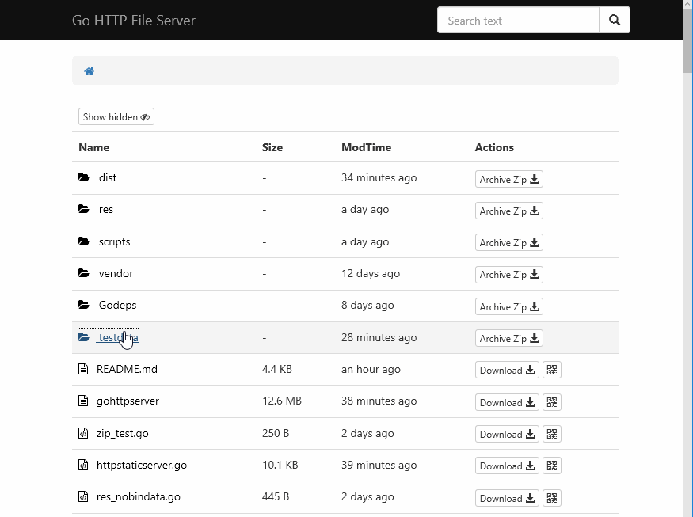

# gohttpserver
[](https://travis-ci.org/codeskyblue/gohttpserver)

- Goal: Make the best HTTP File Server.
- Features: Human-friendly UI, file uploading support, direct QR-code generation for Apple & Android install package.

[Demo site](https://gohttpserver.herokuapp.com/)

- 目标: 做最好的HTTP文件服务器
- 功能: 人性化的UI体验，文件的上传支持，安卓和苹果安装包的二维码直接生成。

**Binaries** can be downloaded from [this repo releases](https://github.com/codeskyblue/gohttpserver/releases/)

## Notes
If using go1.5, ensure you set GO15VENDOREXPERIMENT=1

## Screenshots


## Features
1. [x] Support QRCode code generate
1. [x] Breadcrumb path quick change
1. [x] All assets package to Standalone binary
1. [x] Different file type different icon
1. [x] Support show or hide hidden files
1. [x] Upload support (for security reason, you need enabled it by option `--upload`)
1. [x] README.md preview
1. [x] HTTP Basic Auth
1. [x] Partial reload pages when directory change
1. [x] When only one dir under dir, path will combine two together
1. [x] Directory zip download
1. [x] Apple ipa auto generate .plist file, qrcode can be recognized by iphone (Require https)
1. [x] Plist proxy
1. [ ] Download count statistics
1. [x] CORS enabled
1. [ ] Offline download
1. [ ] Code file preview
1. [ ] Edit file support
1. [x] Global file search
1. [x] Hidden work `download` and `qrcode` in small screen
1. [x] Theme select support
1. [x] OK to working behide Nginx
1. [x] \.ghs.yml support (like \.htaccess)
1. [ ] Calculate md5sum and sha
1. [ ] Folder upload
1. [ ] Support sort by size or modified time
1. [x] Add version info into index page
1. [ ] Add api `/-/info/some.(apk|ipa)` to get detail info
1. [x] Add api `/-/apk/info/some.apk` to get android package info
1. [x] Auto tag version
1. [x] Custom title support
1. [x] Support setting from conf file
1. [x] Quick copy download link
1. [x] Show folder size

## Installation
```
go get -v github.com/codeskyblue/gohttpserver
cd $GOPATH/src/github.com/codeskyblue/gohttpserver
go build && ./gohttpserver
```

## Usage
Listen on port 8000 of all interfaces, and enable file uploading.

```
./gohttpserver -r ./ --addr :8000 --upload
```

## Authentication options
- Enable basic http authentication

  ```sh
  $ gohttpserver --auth-type http --auth-http username:password
  ```

- Use openid auth

  ```sh
  $ gohttpserver --auth-type openid --auth-openid https://login.example-hostname.com/openid/
  ```

  The openid returns url using "http" instead of "https", but I am not planing to fix this currently.

## Advanced usage
Add access rule by creating a `.ghs.yml` file under a sub-directory. An example:

```yaml
---
upload: false
delete: false
users:
- email: "codeskyblue@codeskyblue.com"
  delete: true
  upload: true
```

In this case, if openid auth is enabled and user "codeskyblue@codeskyblue.com" has logged in, he/she can delete/upload files under the directory where the `.ghs.yml` file exits.

For example, in the following directory hierarchy, users can delete/uploade files in directory `foo`, but he/she cannot do this in directory `bar`.

```
root -
  |-- foo
  |    |-- .ghs.yml
  |    `-- world.txt 
  `-- bar
       `-- hello.txt
```

User can specify config file name with `--conf`, see [example config.yml](testdata/config.yml).

To specify which files is hidden and which file is visible, add the following lines to `.ghs.yml`

```yaml
accessTables:
- regex: block.file
  allow: false
- regex: visual.file
  allow: true
```

### ipa plist proxy
This is used for server on which https is enabled. default use <https://plistproxy.herokuapp.com/plist>

```
./gohttpserver --plistproxy=https://someproxyhost.com/
```

Test if proxy works:

```sh
$ http POST https://proxyhost.com/plist < app.plist
{
	"key": "18f99211"
}
$ http GET https://proxyhost.com/plist/18f99211
# show the app.plist content
```

### Upload with CURL
For example, upload a file named `foo.txt` to directory `somedir`

```sh
$ curl -F file=@foo.txt localhost:8000/somedir
```

## FAQ
- [How to generate self signed certificate with openssl](http://stackoverflow.com/questions/10175812/how-to-create-a-self-signed-certificate-with-openssl)

### How the query is formated
The search query follows common format rules just like Google. Keywords are seperated with space(s), keywords with prefix `-` will be excluded in search results.

1. `hello world` means must contains `hello` and `world`
1. `hello -world` means must contains `hello` but not contains `world`

## Developer Guide
Depdencies are managed by godep

```sh
go get -v github.com/tools/godep
go get github.com/jteeuwen/go-bindata/...
go get github.com/elazarl/go-bindata-assetfs/...
```

Theme are all defined in [res/themes](res/themes) directory. Now only two themes are available, "black" and "green".

## How to build single binary release
```sh
go-bindata-assetfs -tags bindata res/...
go build -tags bindata
```

## Reference Web sites

* Core lib Vue <https://vuejs.org.cn/>
* Icon from <http://www.easyicon.net/558394-file_explorer_icon.html>
* Code Highlight <https://craig.is/making/rainbows>
* Markdown Parser <https://github.com/showdownjs/showdown>
* Markdown CSS <https://github.com/sindresorhus/github-markdown-css>
* Upload support <http://www.dropzonejs.com/>
* ScrollUp <https://markgoodyear.com/2013/01/scrollup-jquery-plugin/>
* Clipboard <https://clipboardjs.com/>
* Underscore <http://underscorejs.org/>

**Go Libraries**

* <https://github.com/elazarl/go-bindata-assetfs>
* <http://www.gorillatoolkit.org/pkg/handlers>

## History
The old version is hosted at <https://github.com/codeskyblue/gohttp>

## LICENSE
This project is licensed under [MIT](LICENSE).
